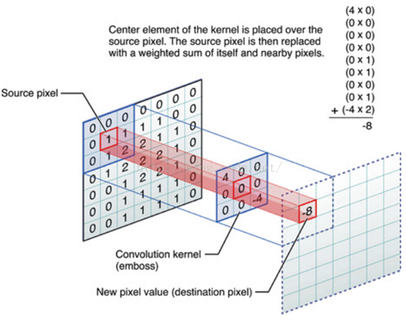
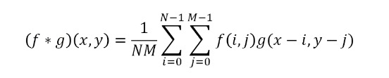
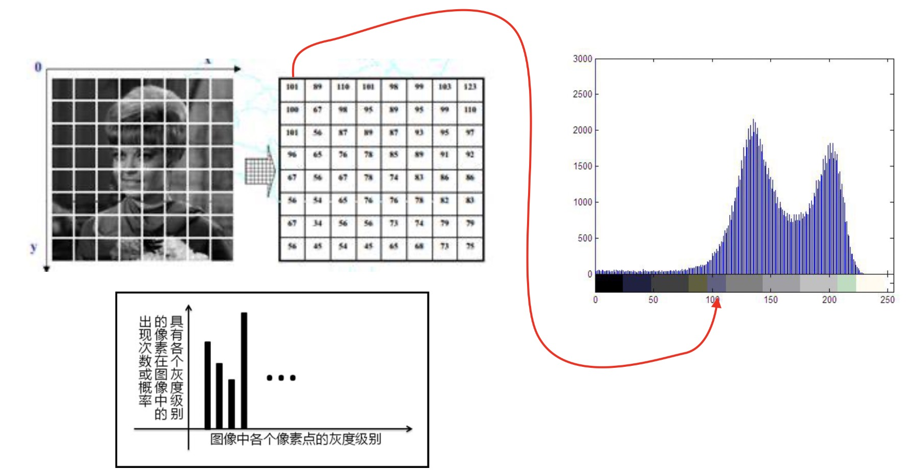
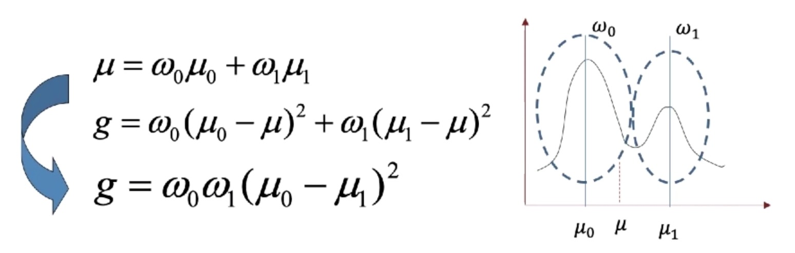
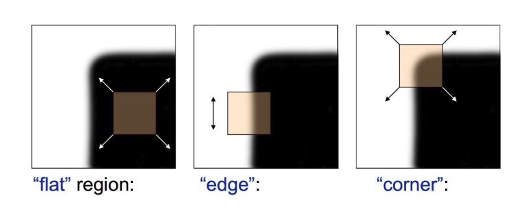
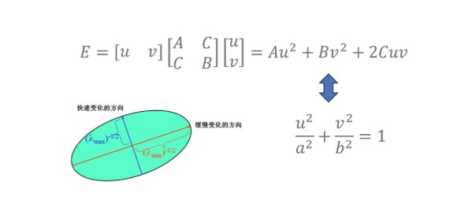
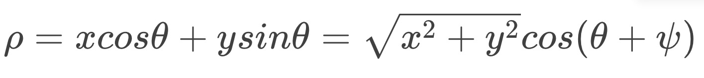
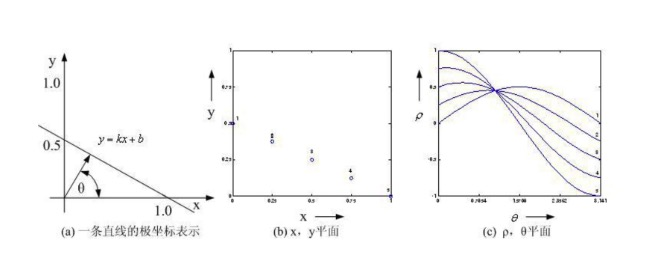

### 画图解释图像卷积滤波的基本原理，并进一步简述常见的图像平滑滤波算法

**基本原理**

    

- 图像卷积滤波其实就是二维卷积, 所谓卷积就是滤波，两者是在不同领域中的名词，一个在数学领域，一个在物理领域
- 在图像中的卷积等同于在原始图像上用一个移动的模板来加权平均，具体的数学公式如下

    

- 一个原始图像f经过一个滤波器(卷积和)g来滤波, g是3*3大小的
- 做卷积的方式是将原始图像上的对应像素和滤波器上的对应像素先进行两两相乘
- 将9个像素对应相乘后的和作为滤波后的结果, 滤完波的位置是滤波器的中心位置也就是原始图像与滤波器中心位置对应的值是刚才滤波后的结果
- 刚刚我们只是得到了一个结果, 如果我们想要最终完成滤波，需要滤波器在这个图像中不断滑动, 也就是从左到右，从上到下的Z字形滑动，每次滑动计算得到一个值
- 滤波后的结果一定比原始图像要小一圈，小多少由滤波器的大小决定的
- 滤波器大小的一半称为滤波器的半径, 3*3的滤波器半径是1(1.5向下取整)
- 原始图像经过半径为1的滤波器进行计算后，周围都少1个像素

**图像平滑滤波算法**

- `平均滤波`
    * 在一个小区域内(通常3*3), 把所有像素都做下平均, 我们就得到了我们最简单的一个滤波器叫平均滤波
    * 为了保证滤波后图像的能量大小和滤波后相同, 需要除上一个系数M, 这叫归一化处理
    * 属于线性滤波
- `加权平均滤波`
    * 在一个小区域内(通常3*3), 像素值加权平均
    * 在每个像素前面乘上一个系数, 同样除上M进行归一化处理
    * 加权平均最主要的作用是图像中心点起到的作用是最大的
    * 在图像滤波的时候离中心越近, 它的作用越重要
    * 比如1/16的滤波器比较特殊, 中心点权值最高为4, 上下左右为2, 斜角各为1, 权值关于中心对称
    * 形象上像个草帽(抽象), 也像是高斯函数的形状
    * 我们称之为高斯模板, 这种滤波叫高斯平均滤波
    * 属于线性滤波
- `中值滤波`
    * 我们选定一个窗口后，针对这个窗口内的图像的像素进行滤波
    * 首先把这个窗口内的像素按照从小到大，或从大到小的顺序进行排列
    * 找到中间的值4, 进一步我们把4作为滤波后的结果
    * 中值滤波对椒盐噪声有效
    * 非线性滤波，更为直观

### 简述边缘检测的基本原理，以及Sobel、LoG和Canny算子的原理差异

**边缘检测原理**

- 边缘是图像最重要的一类特征，在生活中速写就是用铅笔勾勒出图像的边缘信息
- 我们通过速写识别作画的内容，也就是说边缘能够提供图像中特别重要的信息
- 边缘一般是指图像在某一局部强度剧烈变化的区域
- 边缘检测的目的是标识数字图像中亮度变化明显的点，图像属性中的显著变化通常反映了属性的重要事件和变化
- 如果将边缘认为是一定数量点亮度发生变化的地方，那么边缘检测大体上就是计算这个亮度变化的导数
- 边缘检测的实质是采用某种算法来提取出图像中对象与背景间的交界线
- 我们将边缘定义为图像中灰度发生急剧变化的区域边界
- 图像灰度的变化情况可以用图像灰度分布的梯度来反映
- 因此我们可以用局部图像微分技术来获得边缘检测算子
- 经典的边缘检测方法，是通过对原始图像中像素的某小邻域构造边缘检测算子来达到检测边缘这一目的
- 总结来说，边缘检测的本质是微分, 实际中常用差分，x方向和y方向

**Sobel算子原理**

- Sobel算子根据像素点上下、左右邻点灰度加权差，在边缘处达到极值这一现象检测边缘
- 对噪声具有平滑作用，提供较为精确的边缘方向信息，边缘定位精度不够高
- Sobel算子不但产生较好的检测效果，而且对噪声具有平滑抑制作用，但是得到的边缘较粗，且可能出现伪边缘
- 当对精度要求不是很高时，是一种较为常用的边缘检测方法

**LoG算子原理**

- LoG (Laplacian of Gaussian) 高斯拉普拉斯算子
- 基本思想是：首先对原始图像进行一次高斯滤波, 然后再求Laplace
- 也就是说高斯拉普拉斯算子等价于先对高斯函数求二阶导，再与原图进行卷积

**Canny算子原理**

- 使用高斯函数的一阶导数同时完成平滑图像和计算微分
- 计算梯度(幅值和方向)
- 梯度幅值进行非极大值抑制,消除虚检出的边缘
- 自动边缘连接，断裂的可以重新有效的进行连接
- 核心优点：边缘可自动连通，有效消除虚检出的边缘，是有效检测边缘的方法
- Canny算子考虑了去噪，非极大值抑制和断裂边缘的问题，较为复杂，实际效果也好的多，是目前使用最为广泛的一类算子

**差异总结**

- Sobel算子、LoG算子都是在原始图像上通过一个滤波器模板进行卷积得到的
- 这样得出的结果，虽然形式上简单，但更容易受到噪声的影响
- 同时在求取边缘的时候, 往往因为图像中的噪声或边缘本身的模糊性,
- 导致我们最后求出的边缘不清楚, 或者边缘本来是一种连通的曲线, 结果中间中断了很多
- 也就是说会产生噪声，断裂，虚检等问题
- Canny最核心的优势在于边缘可自动连通，有效消除虚检出的边缘，成为了最有效检测边缘的方法

### 简述图像直方图的基本概念，及使用大津算法进行图像分割的基本原理

**图像直方图**

    

- 关于图像直方图，在我们这里主要研究灰度直方图
- 在左上角的图像每一个像素格分别对应了该像素的对应灰度，在这里我们只考虑灰度图像
- 每个像素对应的灰度幅值是0~255之间，我们可以围绕着这个图像做它的灰度直方图
- 灰度直方图以灰度为横坐标，围绕着每个灰度值在图像中出现的次数作为它的纵坐标
- 灰度直方图描述了图像中灰度的分布情况，在灰度直方图里，波峰位置通常对应这个灰度出现频次最高的位置
- 波谷位置则是出现频次最低的位置
- 我们的纵坐标可以不是出现的频次，而是出现的频次和所有像素个数的一个比例
- 纵坐标使用百分比的好处：所有灰度统计的个数一定是这个灰度像素的个数
- 纵坐标使用百分比，那么这个灰度直方图的积分就是1，所以这个灰度直方图就等同于灰度出现的概率密度函数
- 图像直方图由于其计算代价较小，且具有图像平移、旋转、缩放不变性等众多优点，广泛地应用于图像处理的各个领域
- 特别是灰度图像的阈值分割、基于颜色的图像检索以及图像分类

**大津算法图像分割基本原理**

- 确定最佳阈值，使背景和目标之间的类间方差最大(因为二者差异最大)

    

- 其中一类的均值是u0, 另一类是u1, 整体直方图是均值是u
- w0 和 w1 对应的是每一类直方图的面积，也就是像素的个数
- w0 和 w1 加起来一定等于1(整体), 因为我们分成了2类
- 由1,2的表达式合并得到了表达式3, 我们的任务是选择最佳的阈值, 让类间方差g最大
- 这个问题的难点在于：g与w0, w1, u0, u1相关, 我们的阈值t, 并没有直接出现
- 每次我们阈值t取一个值, w0, w1 都会随之变化, 同样, u0, u1 也会随着阈值t的选择而变化，这个变化关系不是一个简单的数学表达式，而是一个函数关系
- 换句话来说，我们的g和t之间是一个隐函数的关系，我们要求g的最大值就很麻烦
- 找一个更加方便的方法来解决问题，至关重要
- 算法实现: 遍历灰度取值
  * 在灰度直方图上，横轴对应的灰度值是0~255
  * 我们去掉2头,也就是1 ~ 254, 在这254个值中，把t取值从1~254遍历所有的灰度值
  * 把每个t对应的g的值都取出来
  * 最后计算下g的最大值，那对应我们的最佳阈值也就知道了

### 简述Harris算子对角点的定义，进行角点检测的基本原理，并说明引入角点响应函数的意义

**Harris算子对角点的定义**

    

- 通过小方块的所在区域和移动来描述
    * 在灰度变化平缓区域，窗口内像素灰度积分(灰度累加值)近似保持不变
    * 在边缘区域，上下移动(边缘方向移动)灰度积分近似不变，其余任意方向剧烈变化
    * 在角点处，任意方向移动，灰度积分值均剧烈变化

**角点检测的基本原理**

- 结合Harris算子对角点的定义，利用移动的窗口在图像中计算灰度变化值来判断
- 在角点处，任意方向移动灰度积分值均剧烈变化
- 通过对算子卷积核大小的窗口内做灰度积分变化函数
- 通过灰度积分变化函数对应的二次型方程 
- 泰勒展开，变换等处理后，E = Au^2 + Bv^2 + 2Cuv (在这里忽略2Cuv是常数，影响的是几何形状的位置)

    

- 该二次型对应的几何图形为椭圆，A越大, a越小，形成反比例的关系
- 椭圆图上的橙色和蓝色的两个轴对应的是a和b
- 比如轴a越短，对应的A越大，说明E变化的越快速, 所以蓝色轴短代表它对应快速变化的方向
- 从2 * 2的矩阵M中分离出A和B, 分离的方式是采用特征值分解, 进一步可以证明对应2 * 2的矩阵M有两个特征值λ1、λ2
- 它们对应的-1/2次方对应的是椭圆的长短轴
    * 当λ1,λ2都比较小时, 点(x,y)(x,y)(x,y) 处于灰度变化平缓区域
    * 当λ1 >> λ2 或 λ1 << λ2时，说明一个方向变化剧烈，点(x,y)为边界像素
    * 当λ1, λ2都比较大，且近似相等时，有个比较小的u,v, E值就会产生比较大的变化, 点(x,y)为角点
 
**引入角点响应函数的意义**

- 在实际应用中λ1和λ2的小和大比较抽象, 在实际计算时，就会出现问题
- 不同场景中有不同的结果, 我们希望一个智能自动的算法
- `R=detM−k(traceM)^2`
- `traceM = λ1 + λ2`
- `detM = λ1λ2`
- 当R接近于零时，处于灰度变化平缓区域
- 当R<0时，点为边界像素
- 当R>0时，点为角点
- k是一个经验性的系数，通常取值0.04~0.45

### 简述Hough变换的基本原理(包括参数空间变换及参数空间划分网格统计)

参数空间变换：直角坐标系下的每一点都对应极坐标系下的一条正弦曲线, 同一条直线上的多个点，在极坐标系下必相交于一点。对于一条直线，其参数包括斜率和截距。那么在极坐标下就对应一点。
参数空间划分网格统计：在极坐标系下，将空间网格化，将直角坐标系下的方向离散化，将直角坐标系中的点转化极坐标系下，统计各个网格内对应角度下曲线值的数量。设置累计阈值T，计数器大于T的小格对应于共线点，其可以用作直线拟合参数。小于T的反映非共线点，丢弃不用。

- 核心思想：直线 y =kx + by, 每一条直线对应一个k、b, 极坐标下对应一个点(ρ,θ)
- ρ是直线距离原点的距离(直线的过原点的垂线), θ是这条垂线与x轴的夹角
- 直角坐标系下的每一条直线在极坐标(参数空间)下对应一个点 (ρ,θ)
- 直角坐标系的一点(x,y), 对应极坐标系下的一条正弦曲线 ρ = xcosθ + ysinθ

    

- 上公式ψ是初始的向角
- 同一条直线上的多个点, 在极坐标系下必相交于一点

    

- 极坐标系下越多的曲线交于一点，说明对应的曲线在直角坐标系下它的像素就越多，极坐标下的这个交点一定对应原始图像(直角坐标系)中的一条直线
- 相反，极坐标系下只有一两个曲线对应的交点，我们可以认为是孤立的点或噪声，我们就不用考虑了
- 将(ρ,θ) 空间(实际上一个平面)量化成许多小格
- 根据x−y平面(直角坐标系下的)每一个直线点带入θ的量化值，算出各个ρ，将对应格计数累加
- 换句话说，在原始的图像中，经过边缘提取可以得到一系列的边缘点，进一步我们把每个边缘点都转换成(ρ,θ)参数空间下的余弦曲线方程，将余弦曲线带入到(ρ,θ)平面后，得到一个对应的曲线
- 也就是说，如果我们有100个边缘点，那么对应(ρ,θ)空间中我们就有100个余弦曲线
- 在(ρ,θ)空间中的小格中可能有多个余弦曲线相交，有多少条曲线相交，我们就在这个格子里做一个计数
- 当所有直角坐标系下的边缘点完成变换以后, 我们对(ρ,θ)平面下的小格进行检验
- 设置累计阈值T,计数器大于T的小格，那么这个小格，对应于共线点，它的中心点对应的参数，在原始图像中对应一条直线，这个参数可以用作直线拟合
- 小于T的小格反映了非共线点，丢弃不用，而合格的每条线段对应的长度，就是我们格子中的计数值记录的像素数
- 采用参数空间变换的方法，对噪声和不间断直线的检测具有鲁棒性
- Hough变换把原始图像中具有参数的形状转换到对应的参数空间中, 进行个数的累积, 还可用于检测圆、椭圆和其他参数形状
- Hough变换在参数空间中，使用了划分格子，以及对每个格子中出现的个数进行统计的方式叫做**投票**

### 简述SIFT原理(重点是尺度空间和方向直方图原理)及ORB算子原理(重点是FAST和BRIEF)

**SIFT原理**

- SIFT的全称是Scale Invariant Feature Transform(尺度不变特征变换)，SIFT特征对旋转、尺度缩放、亮度变化等保持不变性，是一种稳定的局部特征
- 模仿人的视觉认知，把物体不同尺度下的图像(多个不同分辨率的图像)都提供给机器，让机器能够对物体在不同的尺度下综合信息识别，因此，首先需要建立**尺度空间**
    * 通过高斯函数与原图像卷积，并经过降采样，可建立原始图像的尺度空间模型
    * 尺度空间的核心思想是通过不同分辨率看同一个图像，可通过不同尺度的高斯函数与原始图像卷积实现
    * 在引入尺度空间的概念后，一个图像不止是二维的，而且拥有尺度的维度, 尺度空间是在传统的图像信息处理模型中，引入一个新的参数：**尺度**
    * 在图像信息处理模型中引入一个被视为尺度的参数，通过连续变化尺度参数获得多尺度下的尺度空间表示序列
    * 进一步对这些序列进行尺度空间主轮廓的提取(轮廓的提取，极值的提取)
    * 并以该主轮廓作为一种特征向量，实现边缘、角点检测和不同分辨率上的特征提取等
    * 它模拟了人在不同距离看目标这种方式，它模拟了人在不同距离看目标的方式，也就是从近到远，这个目标在视网膜上整体的形成过程
    * 主要是建立高斯金字塔和DOG(Difference of Gaussan)金字塔，然后进行极值检测，以初步确定特征点的位置和所在尺度
    * 在实际计算时，使用高斯金字塔每组中相邻上下两层图像相减，得到高斯差分图像，进行极值检测，这样就能得到候选的sift特征点
    * 进一步计算DoG函数的极值点, 在计算的时候，我们是在尺度空间计算的极值，这意味着我们有三个方向：x,y,σ
    * 所以我们在计算极值的时候，不仅要用到上下左右，它周围临域的信息, 而且要用到不同层, 上下层像素的信息
    * 关键点是由DoG空间的局部极值点组成的，关键点的初步探查是通过同一组内各DoG相邻两层图像之间比较完成的
    * 为了寻找DoG函数的极值点，每一个像素点要和它所有的相邻点比较，看其是否比它的图像域和尺度域的相邻点大或者小
    * 这就意味着我们要计算一个点位置的极值, 就需要和26个点进行比较，本层有8个,上下层有9个，合起来26个
    * 检测到的极值点是离散空间的极值点
- 然后通过拟合三维二次函数来精确确定关键点的位置和尺度，同时去除低对比度的关键点和不稳定的边缘响应点(因为DoG算子会产生较强的边缘响应)，以增强匹配稳定性、提高抗噪声能力
- 进一步进行关键点特征描述
    * 为了使描述符具有旋转不变性，需要利用图像的局部特征为给每一个关键点分配一个基准方向
    * 使用图像梯度的方法求取局部结构的稳定方向
    * 对于在DoG金字塔中检测出的关键点，采集其所在高斯金字塔图像3σ邻域窗口内像素的梯度和方向分布特征
    * 直方图统计半径为3×1.5σ。即计算以关键点为中心半径3×1.5σ邻域内所有点的梯度方向
    * 梯度直方图将0~360度的方向范围分为36个柱，累计落到每个方向内的关键点个数加权值，以此生成**梯度方向直方图**
        * 将梯度方向直方图中纵坐标最大的项代表的方向分配给当前关键点作为主方向
        * 若在梯度直方图中存在一个相当于主峰值80%能量的峰值，则将这个方向认为是关键点的辅方向
        * 辅方向的设计可以增强匹配的鲁棒性，Lowe指出，大概有15%的关键点具有辅方向，而恰恰是这15%的关键点对稳定匹配起到关键作用
        * 对于每一个关键点，拥有三个信息:位置、尺度以及方向
        * 接下来就是为每个关键点建立一个描述符，用一组向量将这个关键点描述出来，使其不随各种变化而改变，比如光照变化、视角变化等等
        * 这个描述子不但包括关键点，也包含关键点周围对其有贡献的像素点，并且描述符应该有较高的独特性，以便于提高特征点正确匹配的概率
        * SIFT描述子是关键点邻域高斯图像梯度统计结果的一种表示
        * 通过对关键点周围图像区域分块，计算块内梯度直方图，生成具有独特性的向量，这个向量是该区域图像信息的一种抽象，具有唯一性
- * Lowe实验表明描述子采用在关键点尺度空间内4 * 4的窗口中计算的8个方向的梯度信息，共4 * 4 * 8 = 128维向量表征，综合效果最优，具体步骤如下：
    * 确定计算描述子所需的图像区域, 特征描述子与特征点所在的尺度有关，因此，对梯度的求取应在特征点对应的高斯图像上进行
    * 将坐标轴旋转为关键点的方向, 以确保旋转不变性, 获取旋转后邻域内采样点的新坐标
    * 在图像半径区域内对每个像素点求其梯度幅值和方向，然后对每个梯度幅值乘以高斯权重参数，生成方向直方图
    * 在窗口宽度为2 * 2的区域内计算8个方向的梯度直方图，绘制每个梯度方向的累加值，即可形成一个种子点
    * 然后在下一个2 * 2的区域内进行直方图统计，生成下一个种子点，一共生成16个种子点
    * 描述子向量元素门限化以及门限化后的描述子向量规范化
    * 描述子向量门限
    * SIFT特征描述向量生成

**ORB算子原理**

- ORB（Oriented FAST and Rotated BRIEF）是一种快速特征点提取和描述的算法，ORB = oFast + rBRIEF
- oFAST特征提取
    * 粗提取
        * 判断特征点：从图像中选取一点P，以P为圆心画一个半径为3像素的圆，圆周上如果有连续N个像素点的灰度值比P点的灰度值大或小，则认为P为特征点，这就是大家经常说的FAST-N。有FAST-9、FAST-10、FAST-11、FAST-12，大家使用比较多的是FAST-9和FAST-12
        * 快速算法：为了加快特征点的提取，快速排出非特征点，首先检测1、5、9、13位置上的灰度值，如果P是特征点，那么这四个位置上有3个或3个以上的的像素值都大于或者小于P点的灰度值。如果不满足，则直接排出此点
    * 筛选最优特征点
        * 选取进行角点提取的应用场景下的一组训练图像
        * 使用FAST角点检测算法找出训练图像上的所有角点
        * 对于每一个角点，将其周围的16个像素存储成一个向量，对所有图像都这样做构建一个特征向量
        * 每一个角点的16像素点都属于下列三类中的一种，像素点因此被分成三个子集：Pd, Ps, Pb
        * 定义一个新的布尔变量Kp ，如果是角点就设置为True，否则就设置为False
        * 使用ID3算法来查询每一个子集
        * 递归计算所有的子集直到它的熵为0，被构建好的决策树用于其它图像的FAST检测
    * 使用非极大值抑制算法去除临近位置多个特征点
        * 计算特征点出的FAST得分值s（像素点与周围16个像素点差值的绝对值之和）
        * 以特征点p为中心的一个邻域（如3x3或5x5）内，若有多个特征点，则判断每个特征点的s值
        * 若p是邻域所有特征点中响应值最大的，则保留；否则，抑制。若邻域内只有一个特征点，则保留
    * 建立金字塔以实现特征点多尺度不变性
        * 设置一个比例因子scaleFactor（opencv默认为1.2）和金字塔的层数nlevels（Opencv默认为8）
        * 将原图像按比例因子缩小成nlevels幅图像
        * nlevels幅不同比例的图像提取特征点总和作为这幅图像的oFAST特征点
        * 特征点的旋转不变性。ORB算法提出使用矩（moment）法来确定FAST特征点的方向
        * 也就是说通过矩来计算特征点以r为半径范围内的质心，特征点坐标到质心形成一个向量作为该特征点的方向
    * Fast检测足够快，检测时角点可以检测出来，但是会存在大量的误检
- rBRIEF特征描述
    * ORB算法的特征描述是由BRIEF算法改进的，这里称为rBRIEF（Rotation-Aware Brief）
    * 也就是说，在BRIEF特征描述的基础上加入旋转因子从而改进BRIEF算法
    * BRIEF算法描述
        * BRIEF算法计算出来的是一个二进制串的特征描述符。它是在一个特征点的邻域内，选择n对像素点pi、qi (i=1,2,…,n）
        * 比较每个点对的灰度值的大小，如果I(pi)>I(qi),则生成二进制串中的1，否则为0
        * 所有的点对都进行比较，则生成长度为n的二进制串。一般n取128、256或512，opencv默认为256
        * 以关键点P为圆心，以d为半径做圆O
        * 在圆O内某一模式选取N个点对
        * 定义操作T
        * 分别对已选取的点对进行T操作，将得到的结果进行组合
    * 具有旋转不变性的BRIEF
        * steered BRIEF（旋转不变性改进）
        * 在使用oFast算法计算出的特征点中包括了特征点的方向角度
        * 经过旋转角度θ旋转，得到新的点对
        * 在新的点集位置上比较点对的大小形成二进制串的描述符
    * BRIEF算法的改进
        * rBRIEF-改进特征点描述子的相关性
        * BRIEF的一个比较好的特性是，对于所有的特征点上的每一位（bit）上的值的平均值都非常接近0.5
        * 而steeredBRIEF在可区分性(相关性）上不如原始的BRIEF算法
        * 对BRIEF和steeredBRIEF两种算法的比较可知，BRIEF算法落在0上的特征点数较多
        * 因此BRIEF算法计算的描述符的均值在0.5左右，每个描述符的方差较大，可区分性较强, 而steeredBRIEF失去了这个特性
        * 为了改进BRIEF算法，首先建立300k个特征点测试集。对于测试集中的每个点，考虑其31x31邻域
        * 在对图像进行高斯平滑之后，使用邻域中的某个点的5x5邻域灰度平均值来代替某个点的值，进而比较点对的大小
        * 使用积分图像加快求取5x5邻域灰度平均值的速度
        * 在31x31的邻域内共有(31-5+1)x(31-5+1)=729个这样的子窗口，那么取点对的方法共有M=265356种
        * 我们就要在这Ｍ种方法中选取256种取法，使这256种取法之间的相关性最小