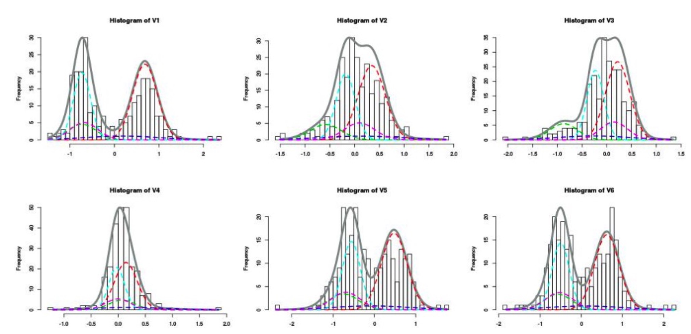

### 简述混合高斯模型的基本原理，以及通过混合高斯模型进行背景建模的基本思想

**混合高斯模型的基本原理**

    

- 基于高斯模型的背景建模里，我们把每一个像素，它随时间的分布用一个高斯模型刻画
- 但在实际中，这个像素它的灰度值变化，它的分布情况不能够简单的用一个高斯模型去描述
- 所以我们需要对我们的建模方式进行扩展，用多个高斯模型组合起来进行刻画，简单来说就是混合高斯模型
- 也就是说任何一个分布函数，都可以看作是多个高斯分布的线性加权组合
- 上图中的每一个分布函数，我们可以近似的看做：蓝线对应的高斯分布，红线对应的高斯分布以及底下不同颜色对应的虚线标出来的高斯分布的组合
- 同样对应其他的几个，虽然它的分布函数，它的形状差别很大，但是都可以用多个高斯分布的这个线性组合来代替
- 所谓线性组合，我们看到，在一个分布函数中，每个高斯分布的高低不同，这意味着它对应的加权系数不同

**通过混合高斯模型进行背景建模的基本思想**

- 首先进行**模型初始化**，将采到的第一帧图像的每个象素的灰度值作为均值，再赋以较大的方差。初值Q=1, w=1.0
    * 需要说明的混合高斯模型处理的输入是视频，也就是一帧一帧对应的连续的图像序列，我们处理首先从第一帧图像开始处理，对应图像中的每一个像素都要建立一个混合高斯模型
    * 换句话来说，比如这个图像的宽度是384，它的高度是288，那么就有10万多个像素，我们就需要对应每一个像素都建立一个混合高斯模型
    * 我们首先将采到的第1帧图像中每个像素的灰度值作为均值，再赋以较大的方差，因为我们背景建模是迭代进行的，在第1帧的时候我们肯定没有模型
    * 在第1帧会有很多很多像素，从第一个像素开始建立一个混合高斯模型，因为原来没有模型，我们就把当前这个像素的灰度值作为我们第1个高斯分量的均值
    * 比如当前灰度值如果是50的话，那么我们就要把它的均值做成50，因为我们要对它建立一个高斯分布，但只有一个图像，具体没有办法计算方差，所以给一个大一点的初值
    * 这个初值是自行设置的，如$\sigma$ 可以设置成10或20，稍大一点没关系
    * 初始值Q=1，w=1.0，Q是我们所有高斯模型的分量个数，因为我们第一帧，所以只有一个分量，这时候Q=1
    * 同样因为我们只有第1帧，所以对应的权值也是等于1的
- 第二步是**模型学习**，将当前帧的对应点象素的灰度值与已有的Q个高斯模型作比较，若满足$|x_k - u_{q,k} < 2.5\sigma_{q,k}|$，则更新(按上面方式调整第q个高斯模型的参数和权重)，否则转入下一步
    * 假设现在来了第2帧，我们还是看对应的像素，这个像素首先和我们对应的这个模型进行比较，那么看它是不是落在我们当前的高斯分量
    * 因为目前我们只有一个高斯分量，所以把它和高斯分量进行比较的时候，我们只需要看一个分量就可以了
    * 假设的第2帧它对应的这个值是53，那么我就把53和50做比较，明显它落在第1个高斯分量的内部，也就是说满足这个条件
    * 这个时候需要去调整这个高斯分量对应的参数了，有2个参数，均值和方差，因为我们有两个数据，一个是50，一个是53
    * 所以它的均值变成了51.5，它的方差，我们就可以根据这两个数算出来，这就是我们调整过程
    * 我们假设第3帧又来了，还是这个像素，加入这时候它的像素发生比较大的变化，比如说变成180了
    * 重复刚才的过程，那么还是把这个分布做比较，它明显落在一个位置，不属于这个高斯分量了
    * 因为当前只有一个高斯分量，Q是我们允许的最大高斯分量的个数，通常Q取值3~5，假设我们给它5，因为目前只有一个，所以1<5
    * 那么我们就把当前这个像素以它为一个新的高斯分量，它的均值再建立起来一个高斯分量
    * 这时候我们增加了一个新的高斯分量，那么它的均值就是180，它的$\sigma$的还是等于10
    * 假设第4帧又来了，这个值等于185，那么明显的它又落到了均值为180的高斯分量上，这时候这个高斯分量的均值变成了(180+185)/2，它的方差也可以依此计算
- 第三步是**增加/替换高斯分量** 若不满足条件，且$q<Q$，则增加一个新分量; 若q=Q，则替换
    * 这个过程依次进行，我们的高斯分量就会不断的去更新，不断的往后增加，一直增加到最大的数量，比如说它等于5的时候，这个时候我们就没有办法再增加了，我们就会替换
    * 替换的意思就是假设我们已经有了5个分量，现在又来了一个新的分量，我们就要把对应权值最小的一个给去除，因为权值越小，它起的作用就越小
- 第四步是**判断背景** $B = arg_b min(\sum_{q=1}^b w_q > T)$
    * 最后，假设经过了1000帧，背景已经基本建立起来了，那1001来了以后，我们怎么样判断当前这个像素它是不是属于背景，需要用上面这个公式来判断
    * 比如我们现在有5个高斯分量，它们对应的权值分别是：0.4，0.3，0.18，0.06，0.06，把这几个权值按照从大到小的顺序排列，这里已经是有序的了
    * 进一步，我们分别把权值进行累加，然后再取一个t，通常t取值0.6~0.9之间的数，这里我们取值0.6
    * 那么我们就说，前面两个是背景分布对应的高斯分量，换句话来说，我们就认为后面三个是因为噪声或其他因素的影响
    * 我们就认为如果是当前像素，属于这两个比较大的分布，可以认为它是一个背景像素
- 第五步是**判断前景**
    * 反之，我们认为它不是一个背景，或者说它就是一个运动目标的一个像素

### 解释光流计算中的恒定亮度假设，进一步简述L-K光流估计方法的基本原理

**光流计算中的恒定亮度假设解释**

- L-K算法的提出是基于三个假设：① 亮度恒定不变、② 时间连续或者运动是“小运动”、③ 空间一致
- 其中的亮度恒定不变假设是指：目标像素在不同帧间运动时外观上是保持不变的，对于灰度图像，假设在整个被跟踪期间，像素亮度不变

**L-K光流估计方法的基本原理**

- 通过光流方程 $I_x \Delta x + I_y \Delta y = - I_t$ 公式来说明
- 假设有一个像素在t帧和t+1帧有一个微小的位移，从t到t+1帧运动过程中，因为灰度是连续变化的，在之前位置灰度值也变化，通过像素变化推演中心点大概走了多少
- 换句话来说，通过当前位置亮度在x和y方向，以及它在相邻两帧中灰度的变化值$I_t$, 去估计 $\Delta x, \Delta y$就是光流估计的基本思想
- 从数学的角度来说，$I_x, I_y, I_t$ 分别对应当前图像在当前的像素(x,y)，它在x方向，y方向，t轴方向的偏导数
- 当给定2帧图像时，对应的偏导数是可求的，可使用差分来代替
- 所以 $I_x, I_y, I_t$ 都是已知的，$\Delta x, \Delta y$ 是这个像素在相邻的两帧的位移值
- 我们的任务是求$(u,v) = (\Delta x, \Delta y)$, 存在的困难是在一个方程中，有两个未知数
- 对应一个方程求解2个未知数显然是做不了的，那怎么办呢，我们需要找到其他的解决方案
- 举个例子，有一个方框是3 * 3的像素，对应第一个像素而言，基本的光流方程是 $I_{x_1} u + I_{y_1} v = - I_{t_1}$
- 对应3 * 3窗口里的所有像素，它都有 $I_{x_i} u + I_{y_i} v = - I_{t_i}$
- 进一步把表达式写成矩阵的形式，也就是 $\begin{bmatrix} I_{x_1} & I_{y_1} \\ I_{x_2} & I_{y_2} \\ . & .  \\ . & . \\ . & . \end{bmatrix} \begin{bmatrix}  u \\ v \end{bmatrix} = - \begin{bmatrix} I_{t_1} \\ I_{t_2} \\ . \\ . \\ . \end{bmatrix}$
- 每一行对应一个像素，右边乘上对应一个位置向量，$u$和$v$分别对应$\Delta x, \Delta y$, 把所有的行放在一起，构成了一个矩阵方程
- 简写为 $Au = b$，其中 $A = \begin{bmatrix} I_{x_1} & I_{y_1} \\ I_{x_2} & I_{y_2} \\ . & . \\ . & . \\ . & .  \end{bmatrix}$ , $u = \begin{bmatrix} u \\ v \end{bmatrix}$，$b = \begin{bmatrix} I_{t_1} \\ I_{t_2} \\ . \\ . \\ . \end{bmatrix}$
- 根据表达式，我们要求u, 而A，b矩阵中的所有元素都是已知的
- 这个问题等同于求解一个最小化的问题，$Au = b$ 就是求解 $min ||Au - b||$，也就是$Au - b$的范数最小值
- 这个实际上就是一个最小二乘的问题，最终得到这个表达式 $u = (A^TA)^{-1}A^Tb$
- 需要注意的是$(A^TA)$要可逆
- 区域像素只有2个时，就是2元一次方程组求解，多个像素，如3 * 3时，则是求上述最小二乘解
- **思路**：在一个小的图像邻域内所有像素的速度近似一致，求中心点的速度，如果和中心点距离越远，那么和中心点关联越小，需要加一个权值w, 这个权值和当前中心点的位置，和中心点的距离有关
- **约束**：$E(\Delta x, \Delta y) = \sum_i w_i^2(I_{x_i} \Delta x + I_{y_i} \Delta y + I_{t_i})^2$
- $min E(\Delta x, \Delta y)$
- 对应 $\begin{bmatrix} w_1 & 0 & 0 \\ 0 & ... & 0 \\ 0 & 0 & w_N \end{bmatrix} \begin{bmatrix} I_{x_1} & I_{y_1} \\ I_{x_2} & I_{y_2} \\ . & . \\ . & . \\ . & .  \end{bmatrix} u = \begin{bmatrix} w_1 & 0 & 0 \\ 0 & ... & 0 \\ 0 & 0 & w_N \end{bmatrix} b$
- 求解后可得到 $u = (A^TW^2A)^{-1}A^TW^2b$， $W$对应的是权值矩阵
- 再来看下可逆是否可以实现，也就是可信度判断，$A^TA = \begin{bmatrix} \sum I_xI_x & \sum I_xI_y \\ \sum I_xI_y & \sum I_yI_y \end{bmatrix} = \sum \begin{bmatrix} I_x \\ I_y \end{bmatrix} \begin{bmatrix} I_x & I_y \end{bmatrix} = \sum \nabla I(\nabla I)^T$
- 在这个表达式里面，它实际上是和当前图像沿着x和y方向的梯度是密切相关的，如果$I_x$ 和 $I_y$ 有一项为0的话，对应的项则是0, 这时候$A^TA$就是不可逆的
- 什么情况下，这个图像沿着x和y方向求偏导接近于0呢，一定是这个图像中对应的位置灰度变化相对平坦，比如全黑的区域，所有像素值都一样，所以$I_x$和$I_y$都等于0
- 显然在这个区域里面我们是没有办法计算光流的，因此，我们计算光流的时候，要求图像对应的位置要有充分的特征，或者说沿着x和y方向灰度变化都比较充分
- 进一步从数学上，判断一个矩阵是否可逆，可以通过特征值来判断，进一步可以对这个矩阵求特征值，如果两个特征值远大于0的话，说明求逆是可靠的
- 换句话说如果有一个接近0，这时候求逆操作不可靠，这个时候这个矩阵就很难求逆了
- LK算法对处理目标是小位移的情况下有效，但实际中，目标运动很快的话，此方法无法处理，我们需要对此方法进行改进
- 我们可以采用图像金字塔的方法对图像进行处理，也就是`金字塔L-K方法`，较为高级，此处不再赘述！

### 备注

- 数学公式基于LaTeX编写，推荐安装相关插件进行阅读